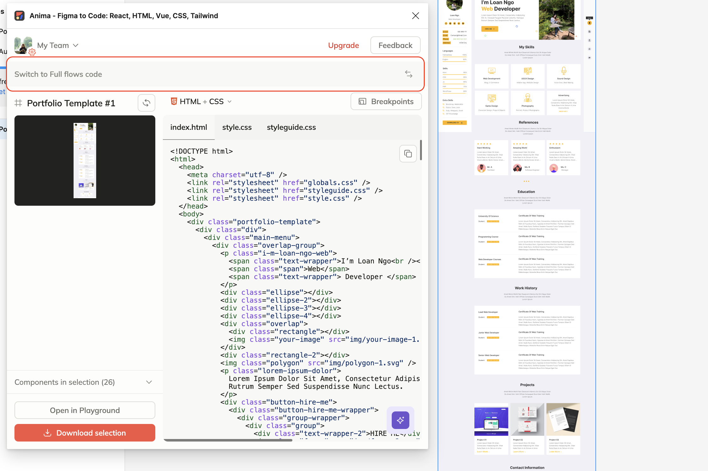

# Review

## Hình ảnh

* Đối với hình ảnh việc tạo code từ design đang bị hạn chế, để thêm hình ảnh và thay đổi hình ảnh mọi người tìm kiếm những tag như `src` để thay thế bằng cách tạo thư mục `/img` sau đó thay thế hình ảnh tương ứng bằng `./img/[image_name].[định dạng file]`

* Đối với phần tử menu mọi người có thể tuỳ chỉnh bằng cách thêm thuộc tính `positition: fixed;`

* Cách đặt **tên** các box design sẽ quyết định tên `classname`

* Thêm link liên kết với thẻ `a`

```html
<a href="[Liên kết cần đến]">liên kết</a>
```

## Cấu trúc template

Để định dạng cấu trúc html cho title và header, dùng cấu trúc bên dưới và dán code được tạo vào phần body.

```html
<!DOCTYPE html>
<html lang="en">
<head>
    <meta charset="UTF-8">
    <meta name="viewport" content="width=device-width, initial-scale=1.0">
    <title>Document</title>
</head>
<body>
    [Dán code ở đây]
</body>
</html>
```

## Anima Issue

Vấn đề mà mọi người không lấy được code là vì mọi người chưa chuyển trạng thái. Mọi người kiếm tra lại cài đặt theo hình bên dưới để generate lại code nha!



## Benefits

* Hỗ trợ công việc nhanh hơn, thay vì tập trung vào tạo UI như trước mọi người có thể nhờ sự support của AI để có thể tập trung vào code backend và những logic khác.

* Đối với những bạn không thể code có thể ứng dụng những design cơ bản để có thể tạo được trang web UI cá nhân, kết hợp với `[username].github.io`. Nếu muốn làm design cao siêu hơn có thể tìm hiểu thêm về cách sử dụng những công nghệ này.
